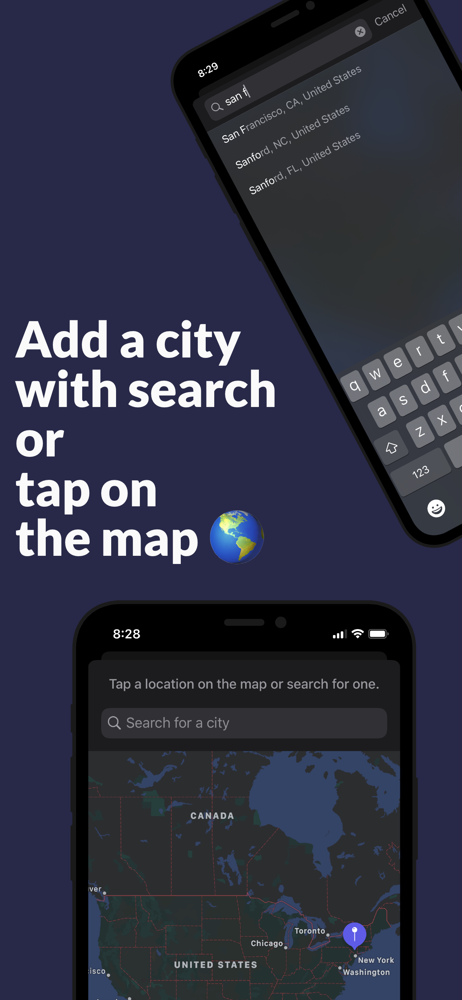

# Weather

Throughout the spring of 2020, I built this weather app. The main goal was to become proficient in **Objective-C** and strengthen my understanding of the 
fundamentals in iOS development.  

    

## Feature Splotlight

In the following few sections, I wanted to discuss a few of my favorite parts about this project. 

### Custom `UIViewController` Transitions

In the app, the main screen is a view controller with a [`UICollectionView`](https://developer.apple.com/documentation/uikit/uicollectionview?language=objc)
displaying a user's stored forecasts. When a user taps a cell, a view controller appears showing detailed information about that particular forecast. 

I wanted to animate this transition with a fluid animation that really brought the user's gesture to life. Since the forecast information displayed in the cell was
also displayed in the cell's detail view controller, I wanted to animate the position of details like the temperature and location name so the cell appears to 
morph into the detail view controller. 

When I started, view controller transitions seemed like a black box to me. But after mulitple read-throughs of Apple's View Controller Programming Guide, 
I started to understand how I could go about implementing this. When things started to finally come together, I played around with chaining on a bunch
of small animations that made everything feel more delightful.
&nbsp;  
&nbsp;  

### Gesture Driven Graphing

The temperature plot is one of my favorite parts of this app. It models the hourly temperatures by the hour. To keep things minimal, the corresponding time for each 
temperature is hidden but can be shown if the user scrubs over the temperature plot. I even added some light haptic feedback and subtle animations. Everything 
came together really well and it's a really fun feature to use.

Also worth mentioning is that I didn't use a graphing framework. The temperature plots were created using `UIBezierPath`s  that were smoothed with the 
[Catmull-Rom algorithm](https://www.informit.com/articles/article.aspx?p=1998968&seqNum=9). It is quite math-y but performed really well for what I wanted to 
achieve.

The [`GraphView`](./Weather/Graph/GraphView.m) custom view can be fed an array of data points. The `GraphView` then creates a bezier path and makes a 
[`GraphPoint`](./Weather/Graph/GraphPoint.m) for each data point. I also laid a 
[gesture recognizer](https://github.com/ncooke3/Weather/blob/ef9db6426190f1667f445b93ed123b0d888387fa/Weather/Graph/GraphView.m#L86) on top of the graph that
expands points on the graph so the user can see what time the corresponding temperature occurs at.

### Autocomplete location search with MapKit

In addition to viewing forecasts that a user has saved, they will also want to add forecasts. I wanted to provide an intuitive experience for users. 
After some brainstorming, I decided to give users two options. They would be presented with an interactive map view where they could either tap the location of the 
forecast they wish to add or search for a location similar to Apple's Weather app.

While I had worked with MapKit before, creating some type of location search feature was new to me. After some exploring, I learned MapKit includes some location 
autocompletion APIs. I combined MapKit's [autocomplete APIs](https://developer.apple.com/documentation/mapkit/mklocalsearchcompleter?language=objc)
with the [diffable datasource](https://developer.apple.com/documentation/uikit/uitableviewdiffabledatasource) APIs available in iOS 13 to create a dynamic location 
searching feature. 

In [`MapViewController`](./Weather/Controllers/Add%20Forecast%20Controllers/MapViewController.m), a map view fills the screen. In the navigation bar is a 
[`UISearchBar`](https://developer.apple.com/documentation/uikit/uisearchbar?language=objc). When the user taps on the search bar and starts typing. The 
[`SearchResultsController`](./Weather/Controllers/Add%20Forecast%20Controllers/SearchResultsController.m) uses a diffable datasource to display the search results.
The results are retrieved using the [`MKLocalSearchCompleter`](https://developer.apple.com/documentation/mapkit/mklocalsearchcompleter?language=objc).

To highlight the portion of the results that had been matched by the user's query, I changed the color of the text using [`NSAttributedString`](https://developer.apple.com/documentation/foundation/nsattributedstring?language=objc).

## Designing

The hardest part of this app was designing it. In fact, I think I spent the more time designing than I did coding! When I started, I knew I wanted a forecast's 
temperature plot to divide the view it was on. I really liked this concept because the detail view for a given forecast would therefore look different 
each day.

While I'm no designer, I will admit you do learn about what looks good and what doesn't after staring at something long enough! I felt the 
hardest thing about design is it can be hard to know *why* things didn't look good. There were many times I sketched an idea, coded it up, and was unsatisfied
with the result. While frustrating at times, the resulting product, and some of my other recent work seems to be a testament that anyone can design well if you keep practicing, evaluating, and learning from available resources.

### Design Resources
Throughout the design process, I used a few resources that are worth mentioning. [Dribble](https://dribbble.com), [Behance](https://www.behance.net), 
and [Pinterest](https://www.pinterest.com) were all great when it came to brainstorming ideas at the beginning. I would look up things like "ios weather app" 
or "ios ui design" to get an idea of where design is these days.

Another big help was the Apple's [Human Interface Guidelines](https://developer.apple.com/design/human-interface-guidelines/ios/overview/themes/). I am a big fan 
of Apple design and Apple provides their developers with lots of resources to make their apps adhere to the iOS aesthetic.

One important takeway is knowing *when* to invest in building a custom view. While building custom views can be really fun, I learned they can introduce visual 
discrepanices that will make the app's UI look less cohesive when combined with UIKit's standard elements. For instance, the temperature plot is a custom view, but 
it's the only custom view in that view controller and is the main focal point. There were more things I had built but ended up taking them out as I felt they 
didn't mesh well with the native iOS aesthetic I was going for.

## Closing Thoughts

There were a lot of other things I learned through building this project. For instance, I spent a lot of time learning about the debugging tools
available in Xcode. After a few weeks of this, I felt much more productive when developing and, to be honest, had a lot more fun too. I read a lot of 
documention from Apple and watched quite a few WWDC videos on everything from UIKit advancements and best practices to Xcode tips and tricks. 

Here were a few of my favorites:
- [Advanced Debugging with Xcode and LLDB](https://developer.apple.com/videos/play/wwdc2018/412/)
- [Advances in UI Data Sources](https://developer.apple.com/videos/play/wwdc2019/220/)
- [A Tour of UICollectionView](https://developer.apple.com/videos/play/wwdc2018/225/)

If you made it to the end, thanks for reading and I hope you enjoyed learning about **Weather**.

P.S. Check the [`media/`](./media) directory for more screenshots of the finished app. 😎
